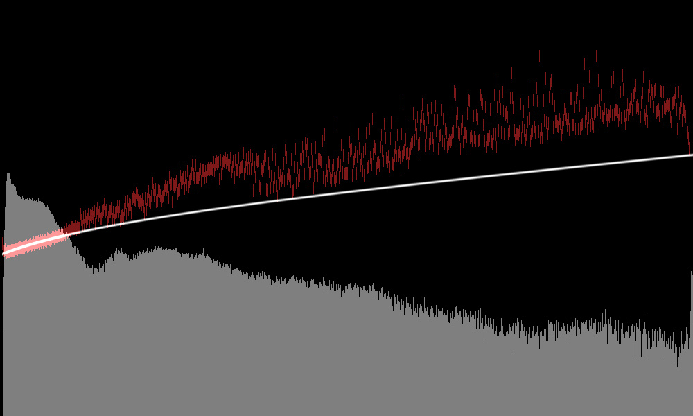

# noise profiling

for various things it is useful to know how much noise we can expect from a
pixel in the raw image file. we fit a gaussian/poissonian mixture to the
observed variance in an image.

to derive the values, there are two processing graphs in the `bin/data/` directory:

```
bin/data/noiseprofile.cfg
bin/data/noisecheck.cfg
```

to wire these to your specific raw file, there is a convenience wrapper bash
script, ```bin/noise-profile.sh```. it takes a single argument, the raw file
you'd like to measure. it will output an nprof file, copy it to the
```data/nprof``` directory, and run the noisecheck graph, resulting in an
output histogram such as the following:



this is a raw histogram in log/log space. the red bars indicate the observed
noise, and the white line is the resulting fit. there is some outlier rejection
mechanism in place that tries to separate signal from noise variance, so the
white line should not blindly match the red bars but take a consistent path
around the minimum of the observed variance (observed is the sum of noise and
signal variance).

note that the same considerations with regard to good profiling shots hold as
they did for darktable previously (cover all dynamic range, out of focus). on
the other hand the new outlier rejection scheme seems to be a lot more robust,
and profiling the raw raw data has the advantage that *black stripes* outside
the crop window contribute to a good estimate of the gaussian portion. as a
result i could pretty much use any shot i wanted to denoise out of the box for
single-shot noise profiling, without the need for dedicated profiling shots.
