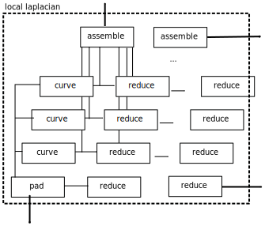
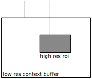

# pipeline overview

the pipeline is organised in layers. the first, user visible, layer is a graph
on modules. these have config params and can be arranged freely, and quickly
read from human readable or binary config files. the next layer consists of
nodes within each module. every module has at least one. a node will map
directly to a shader kernel, and its inputs and outputs will be managed by our
memory manager.

## modules

this is an example graph connecting a few modules, with multiple sinks and
multiple sources:

note that this example includes two interesting use cases that are hard
to realise with linear pipelines.

first, the local laplacian has a loophole for tone manipulating modules, which
would for instance compress the contrast logarithmically or lift shadows a lot.
this will be run only on the coarse pyramid levels, and the assembly will avoid
any halos that usually appear in this context.

second, the demosaicing module includes multiple source images, which can
facilitate pipelines such as the one proposed by the 2019 google siggraph
paper, to achieve denoising and demosaicing from automatically aligned hand
held images.

another thing to note is that consumers of data are modelled as sinks here:
this way it can for instance be made sure that the histogram always stays
up to date.

## nodes

this is one example for the local laplacian module which has particularly many
inner nodes:

TODO: image is incomplete. connections and number of reduce nodes depend on
configuration (contrast curve frequency might be hard coded, but resolution
determines number of levels in pyramids).

external connections are indicated as thick lines. these obviously take the
input to "pad" and the output from the last "assemble" stage. maybe not so
obviously it also has a connection to do tone manipulations for the coarsest
level.  this is useful for hdr images for instance, in this case.

note that in general it is more complicated than this: every external connection
can potentially come with a region of interest and a context buffer. that means
there will be two vulkan buffers associated with the connection.
TODO: show simple gaussian blur with context buffer

## connections

a connection between modules carries an image buffer with all necessary
information. that is:

* geometry of the buffer (overall size, region of interest with scale)
* colour and encoding format information
* if the roi is not full size, there is an additional context buffer

in particular, the image may be transported as two buffers: *roi* and *context*:

it may not come in full for performance and memory reasons: when
developing the image zoomed in, not all of the image has to be processed.
when zoomed out, only a scaled down image may be sufficient.

However, some modules require multi-scale context to be able to correctly
render a roi. that comes in form of the *context* buffer which represents
the full image but scaled down to lower resolution.

a connection between low-level nodes corresponds exactly to one vulkan buffer
(encoded as offset and size in our heap allocation), as well as roi
information. this means the nodes can be mapped directly to glsl kernels.

on the module level, each connection has to carry context information. the
module is responsible for transferring such context from input to output connectors,
and potentially has to replicate the internal node structure. it can also
create cross connections between context buffers and nodes that are used to
process the roi buffer. this means that the context and roi buffers will always
be handed down synchronously, avoiding costly and error prone synchronisation
between independent pipelines.

# pipeline configuration

this is speed critical and needs to be benchmarked.

## modules

come from config files in ascii or binary. 64-bit tokens identify a module,
an instance name, and a connector. from a list of modules and connections,
the high-level module graph can be reconstructed.

## nodes

nodes depend on size of the processed buffers (roi and context, or just a full
buffer? how many wavelet scales?). we can try and put as much as possible
into a similar config file as for modules, but in general there may be a need
for a c callback function that helps setup the nodes from code. this also avoids
some identifier pollution (no need for another instance id inside the module).

# pipeline compilation

the node graph on the lowest level is a directed acyclic graph (DAG) with
multiple sources and multiple sinks. each node directly maps to a glsl shader
kernel and the whole graph can be sorted topologically to map to a vulkan
command buffer.

## topological sort

* probably pull depth-first from sinks, to facilitate dead code eliminiation
* put short sinks directly after node (colour picker or histogram) to end
  the branch quickly and not keep memory buffers around for long

## memory management

* need generic memory manager to find out whether we'll run out of memory on the way
* first pass: determine needed size of temp buffers
* second pass: if necessary, cut down into tiles and re-run until we fit
* allocate one vk memory block with one buffer, use push constants or uniforms
  for buffer offsets
* use allocation and free buffer linked lists (sub-optimal but don't expect N
  to be large, more like 20 at most)

## advanced scheduling

may keep this for the future:

* minimise memory usage/fragmentation
* caching of active module inputs
